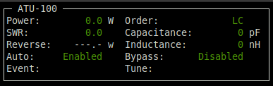

# ATU-100 firmware for serial communication

This is a firmware for using the popular open source ATU-100 Antenna Tuner in remote operations.

This is very useful, for example, to have the tuner right at the feedpoint of the antenna.

It assumes there is no local display so the eeprom cell settings related to the displays are ignored.

Serial messages are JSON format with the assumption there will be external control software.  Line endings are Linux style.

Some external control software is present in the `python` directory.

To use without building there is a suiable hex file in the project root folder.

**NB:**
* This code is a work in progress, so may not be feature complete and only have had modest or incomplete testing.
* This code has only been tested on Linux as I only have Linux systems.

## Build instructions

Build docker image from https://github.com/zsteva/mplab-pic-xc8-builder then start `docker.sh` and run `make`.

A copy of the created hex file will be copied to the root of the project with the build date and time added to the filename so users who just wish to use this code as is do not have to set up the build enviroment and build it.

## How to program

The compiled hex file is on dist\default\production folder.

Just load it on PICkit or any other tool you use for writing the microcontroller, e.g:
`pk2cmd -B/your/path/to/pk2cmd -PPIC16F1938 -FATU_100_EXT_board/FirmWare_PIC16F1938/dist/default/production/FirmWare_PIC16F1938.production.hex -E -M -J -R`

## How to interface

The serial routine runs at a baud-rate of 4800 bps.  The timer limits the reliable data receive rate to this speed.

Use the 3V TTL pins on the rear of PCBA:
* RB1 - Pin 22 - TXD from ATU-100.
* RB2 - Pin 23 - RXD to ATU-100.

## JSON messages

The code is running on a PIC16, a popular choice with hardware engineers who never had to write code.  The JSON processing conforms with the standard but it is only using a limited subset of the format and is not designed to be robust.

Any characters received before the opening `{` and after the closing `}` will be send to the handler used in the code this code was derived from allowing for simple human control, see the non-JSON section.

### From the ATU

From ATU, any field may be omitted if unchanged:

#### System information
```
{
    "Board": "ATU-100_EXT",
    "Credit": "N7DDC",
    "FW": "3.2",
    "Build": "ukoda"
}
```


#### System state
```
{
    "Auto": true,
    "Bypass": false,
    "Efficency": 100,
    "Power": 85,
    "SWR": 1.23,
    "Order": "LC",
    "Capacitance": 47,
    "Inductance": 100
}
```
Where:
* Efficency is a percentage, will not be reported if not calculated.
* Power is in Watts.
* Order will be "CL" of the capacitor is before the inductor and "LC" if after it.
* Capacitance is in pF.
* Inductance is in uH.


#### Settings

Not implemented yet.
```
{
    "timeout": 21
}
```
Only setting that are actually used in the code are sent.


#### EEPROM data

Not implemented yet.
```
{
    "00": "78",
    "01": "01",
    "02": "00",
    "03": "15",
...
    "fe": "00",
    "ff": "00"
}
```
All fields are hex and are address and data pairs

### To the ATU

These are the message that can control the ATU.

NB:
* Currently only postive decimal integer are handled.
* When multiple fields are present there may be a risk of not all being process because of ample use of wait function in code that will be called at the time each feild is received.  This is because the whole received message is not buffered, only the last field received.  Sending messages with a single field is the safest option.
* Replies are blocking so treat as half duplex and wait for any expected replies to be received before sending another message.

#### Change mode of operation
```
{
    "Auto": true,
    "Bypass": false,
}
```

#### Reset tuner to default state
```
{
    "Reset": true
}
```

#### Request state information
```
{
    "Status": true
}
```

#### Start tuning
Other commands will ignored until it has completed
```
{
    "Tune": true
}
```

### Non-JSON commands

From the original zsteva code, sent outside the `{}` brackets:
* a - Toggles auto (automatic tuning)
* b - Toggles bypass
* r - Resets the tuner (makes C = 0 and L=0)
* s - Send the current status
* t - Forces tuning

## Control programs

These are located in the `python` directory.

### atu-100.py

This is a minimal ncurses command line program that communicates directly via a serial port.



Keys are:
* a - Toggles auto (automatic tuning)
* b - Toggles bypass
* q or `esc` - Exits the program
* r - Resets the tuner (makes C = 0 and L=0)
* s - Send the current status
* t - Forces tuning

You can also double click on the `Auto`, `Bypass` and `Tune` screen areas to do the same as the `a`, `b` and `t` keys respectively.

## To do

I would love to clean up all the `char` types being used as `bool` and usually testing for `== 0` as false and `== 1` as true.  However it is high risk because a lot of the compound tests are using the `&` bitwise operator instead of the `&&` boolean operator.  There is a risk if a char is set to a value other that 1 anywhere. For example:
```
if (g_b_Auto_mode & (g_i_SWR_fixed >= e_i_tenths_SWR_Auto_delta) & ((g_i_SWR_fixed > g_i_SWR_fixed_old & (g_i_SWR_fixed - g_i_SWR_fixed_old) > delta) | (g_i_SWR_fixed < g_i_SWR_fixed_old & (g_i_SWR_fixed_old - g_i_SWR_fixed) > delta) | g_i_SWR_fixed_old == 999))
```

If done we could change stuff like:
```
if (g_c_SW == 0)
    g_c_SW = 1;
else
    g_c_SW = 0;
```
to easier to read code like:
```
g_c_SW = !g_c_SW;
```

Some header files do not have protection from multiple inclusion and some, such as `main.h` have `static` type declaration that given the intended scope should be defined in the related c file.  Likewise the regular code in the header files too.

## Acknowledgements

This code is derived from:

https://github.com/zsteva/ATU-100-uart

Which is derived from:

https://github.com/edsonbrusque/ATU-100

Which is derived from:

https://github.com/WA1RCT/N7DDC-ATU-100-mini-and-extended-boards

Which is derived from:

https://github.com/Dfinitski/N7DDC-ATU-100-mini-and-extended-boards

